# Jylos

<div align="center">
  <strong>Español</strong> |
  <a href="README.md">English</a>
</div>

<div align="center">
  
</div>

<div align="center">

[](LICENSE)
[](changelog.md)
[](https://www.oracle.com/java/)
[](https://openjfx.io/)
[](https://www.sqlite.org/)
[](https://maven.apache.org/)
[]()

</div>

<div align="center">
  <strong>Notas de escritorio local-first con preview Markdown, wiki-links, grafo de conocimiento interactivo, plugins, temas y almacenamiento SQLite o bóveda Markdown.</strong>
</div>

## Índice

- [Resumen](#resumen)
- [Funcionalidades](#funcionalidades)
- [Capturas](#capturas)
- [Stack Tecnológico](#stack-tecnológico)
- [Requisitos](#requisitos)
- [Inicio Rápido](#inicio-rápido)
- [Scripts y Comandos (Todos los SO)](#scripts-y-comandos-todos-los-so)
- [Estructura del Proyecto](#estructura-del-proyecto)
- [Configuración](#configuración)
- [Documentación](#documentación)
- [Resolución de Problemas](#resolución-de-problemas)
- [Contribución](#contribución)
- [Licencia](#licencia)

## Resumen

Jylos es una app Java 21 + JavaFX 23 inspirada en flujos tipo Obsidian:

- Escritura/edición rápida con preview Markdown en vivo (GFM, matemáticas KaTeX, emoji)
- Jerarquía de carpetas + etiquetas + favoritos + recientes + papelera
- **Enlaces internos compatibles con Obsidian** (`[[wiki-links]]`, `[texto](nota.md)`) con clic en la vista previa
- **Grafo de conocimiento** (vista global de la bóveda o grafo local alrededor de la nota abierta)
- Panel de **backlinks** (notas que enlazan a la actual)
- Paleta de comandos (`Ctrl+P`) y conmutador rápido (`Ctrl+O`)
- Plugins externos (JAR en `jylos/plugins/`, desde `plugins-source/`) y temas (`themes/` → `jylos/themes/`)
- Almacenamiento: **SQLite** (por defecto) o **bóveda Markdown** en disco (`.md` + frontmatter YAML; menú **Git** opcional)

## Funcionalidades

### Núcleo

- Crear, editar, guardar, eliminar y restaurar notas
- Carpetas y subcarpetas jerárquicas
- Etiquetas con asignación/eliminación (SQLite y bóveda)
- Favoritos y notas recientes
- Papelera con restauración de notas y carpetas anidadas
- **Búsqueda de texto completo** en títulos y cuerpos (navegación desde resultados)
- Ordenación y vistas lista/cuadrícula (título, preview, fechas)

### Editor y vista previa

- Markdown con tablas GFM, autolinks y tachado
- Vista previa en vivo y modos dividido / solo editor / solo preview
- Resaltado de sintaxis (highlight.js)
- **KaTeX** para `$…$`, `$$…$$` y delimitadores LaTeX (assets offline en el JAR)
- Emoji en preview mediante glifos rasterizados (fiables en el WebView de JavaFX)
- **Resolución de wiki-links** compartida con el grafo y los backlinks (`WikiLinkResolver`)

### Grafo de conocimiento

- Overlay a pantalla completa: **Ver → Vista de Grafo**, botón en barra o **`Ctrl+G`** / paleta de comandos
- **Grafo global**: todas las notas y aristas por wiki-links; nodos de **etiquetas** opcionales
- **Grafo local**: nota actual y vecinos a N saltos
- Simulación de fuerzas en **Canvas JavaFX** (repulsión Barnes–Hut, muelles, enfriamiento de alpha — en reposo no consume CPU)
- Zoom/pan, arrastrar nodos, hover resalta vecinos, **clic en nota para abrirla**
- Panel de ajustes: repulsión, fuerza/distancia de enlaces, gravedad central, huérfanos/enlaces no resueltos, flechas, color por carpeta, etiquetas/tamaño/grosor de línea

### Bóveda, Git y adjuntos (modo filesystem)

- Bóveda Markdown; PDF e imágenes con visores integrados
- **Git** si la bóveda es un repositorio: estado, preparar/despreparar, commit, sincronizar (menú **Git**)
- Diálogo de cambios con secciones preparados / sin preparar (notas y adjuntos)

### Productividad

- **Backlinks** en el panel derecho (enlaces entrantes)
- **Nota diaria** y **nueva nota desde plantilla** (`{{title}}`, `{{date}}`, …)
- Exportación por nota y **exportación masiva** de la bóveda a HTML/PDF
- Importar/exportar notas individuales

### UI/UX

- Temas claro, oscuro y **sistema** (sigue el SO cuando eliges Sistema) + temas CSS externos
- Tema de ejemplo: Retro Phosphor (`themes/retro-phosphor/`)
- Preferencias de botones lateral/editor (texto/iconos/auto)
- Barra lateral centrada (carpetas, etiquetas, recientes, favoritos, papelera)
- Interfaz en **inglés** y **español** (`i18n/messages*.properties`)
- Iconos de barra/menús: fuente **Feather** vía Ikonli (`fth-*` en FXML)

### Extensibilidad

- Plugins JAR en `jylos/plugins/` (`scripts/build-plugins.sh`; bytecode **Java 21**)
- Gestor de plugins con IDs estables y carga/deshabilitado seguro
- **Mermaid** integrado en preview (fuente en `plugins-source/`)
- Catálogo de temas externos con fallback seguro

## Capturas

<div align="center">
  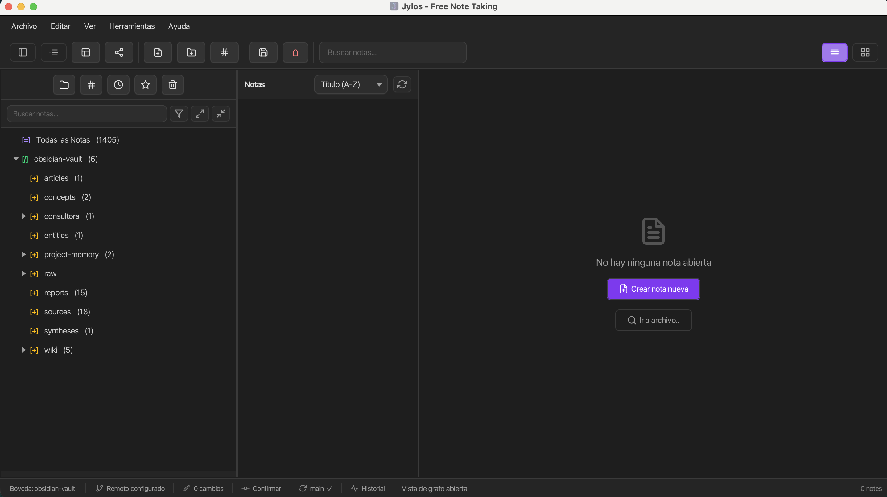
  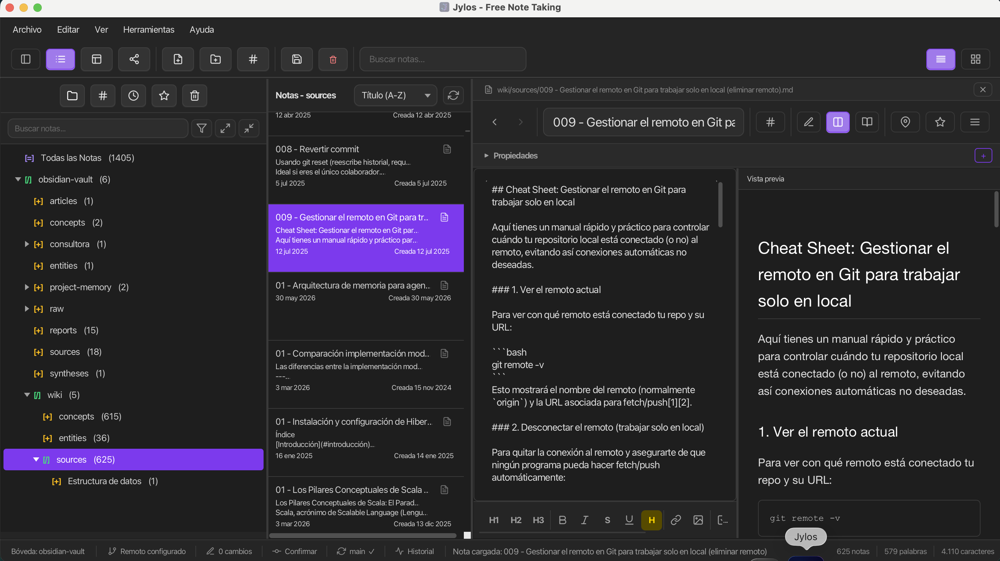
  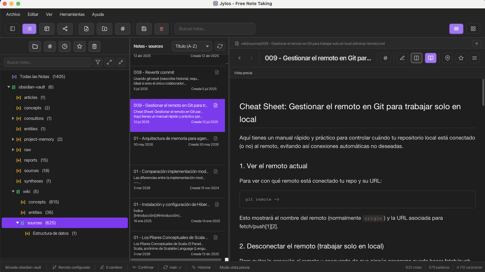
  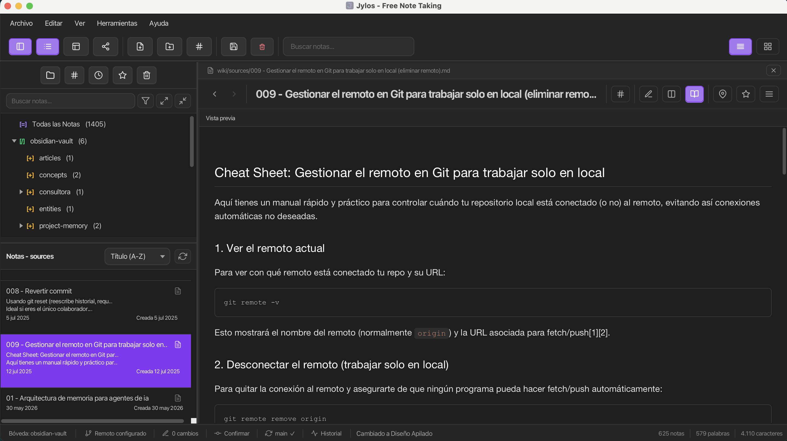
  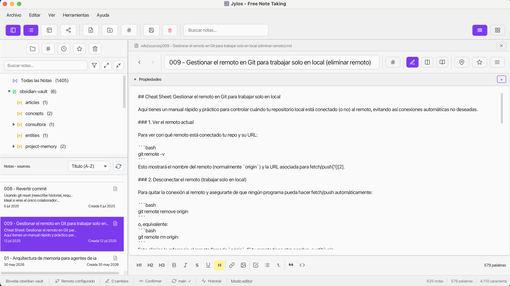
  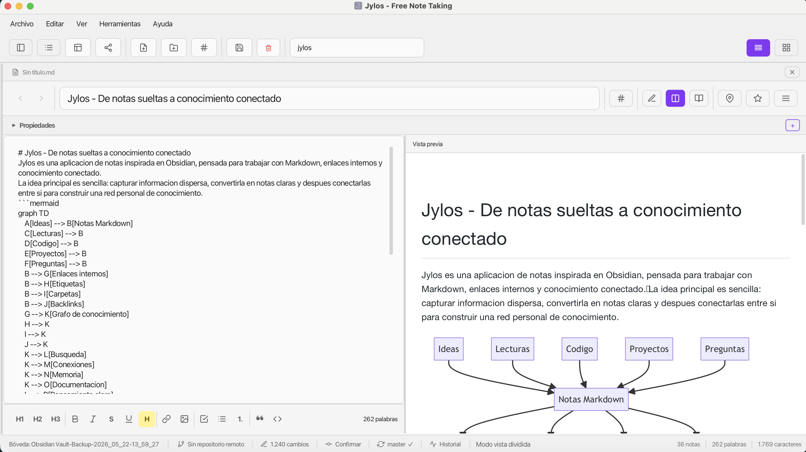
  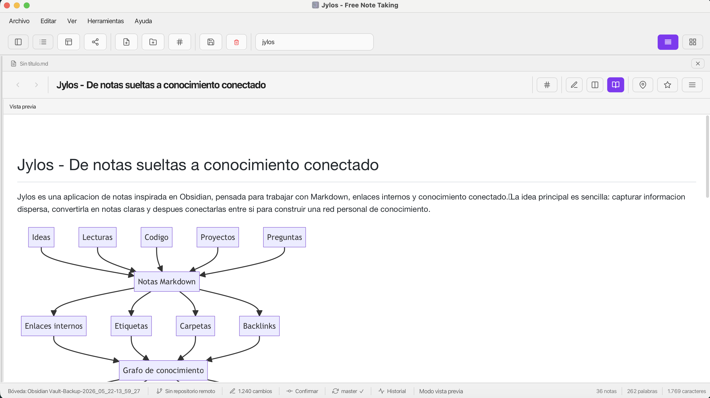
  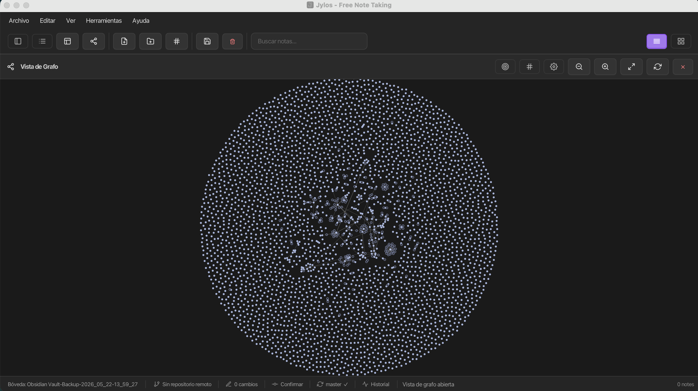
  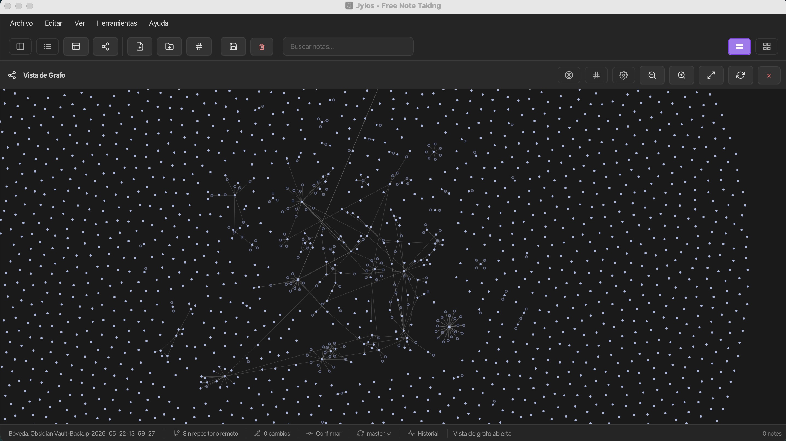
  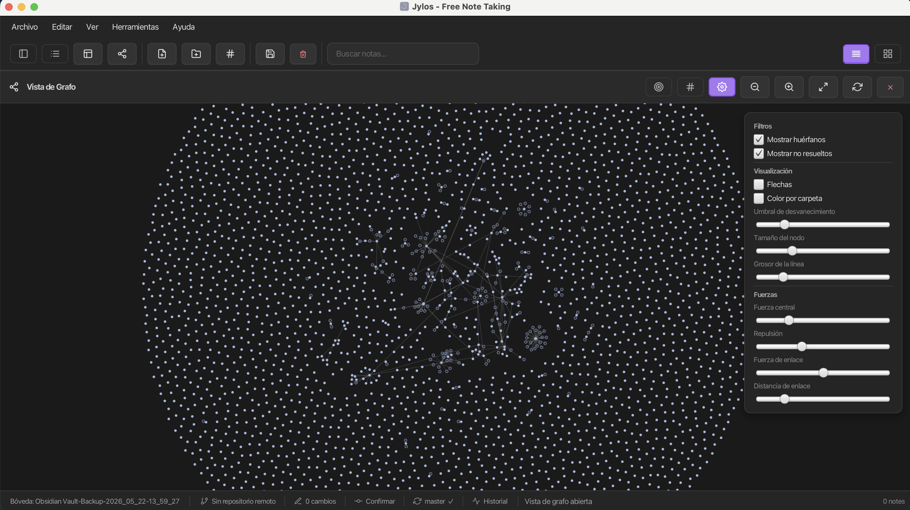
  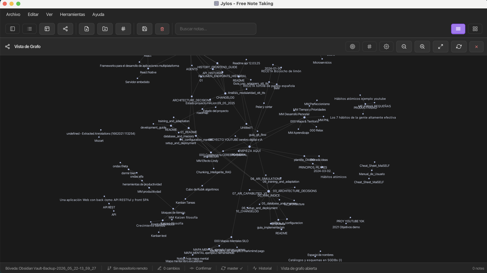
  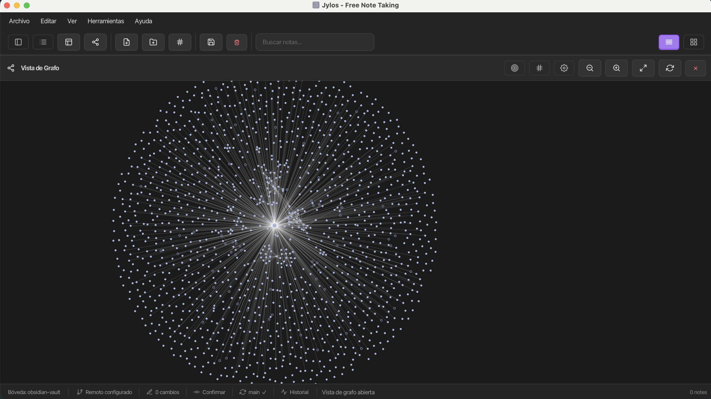
  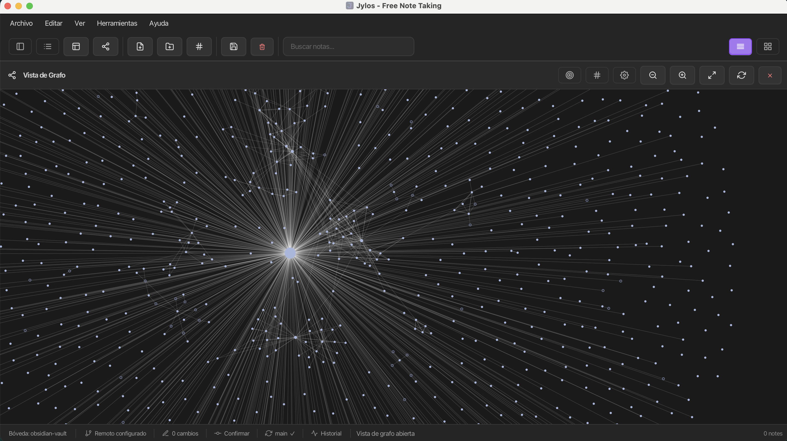
  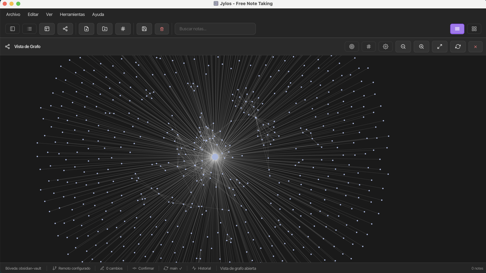
  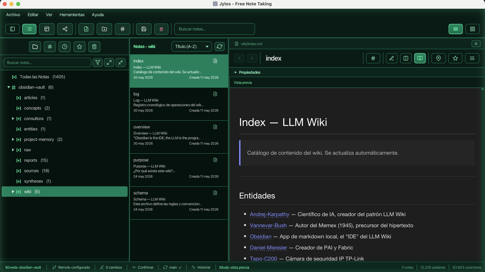

</div>

## Stack Tecnológico

- Java 21
- JavaFX 23
- Maven 3.9+
- SQLite JDBC
- CommonMark
- Ikonli (Feather icons)
- JUnit 5 + H2 (tests)

## Requisitos

1. Java JDK 21
2. Maven 3.9+

Comprobación:

```bash
java -version
mvn -version
```

## Inicio Rápido

### 1) Clonar

```bash
git clone https://github.com/RGiskard7/jylos.git
cd jylos
```

### 2) Compilar

Desde la raíz del repositorio (genera `jylos/target/jylos-1.0.0-uber.jar`):

```bash
./scripts/build_all.sh
```

```powershell
.\scripts\build_all.ps1
```

Equivalente Maven:

```bash
mvn -f jylos/pom.xml clean package -DskipTests
```

### 3) Ejecutar

Usa un launcher (configura `--module-path` de JavaFX). Requiere el uber-JAR del paso 2:

```bash
./scripts/launch-jylos.sh
```

```powershell
.\scripts\launch-jylos.bat
# o
.\scripts\launch-jylos.ps1
```

`run_all.*` es un runner alternativo. `java -jar` sin module-path suele fallar con JavaFX.

## Scripts y Comandos (Todos los SO)

Todos los comandos asumen la **raíz del repositorio** (la carpeta que contiene `jylos/` y `scripts/`).

### Matriz Build / Run

| Propósito | Linux/macOS | Windows PowerShell | Windows CMD |
|---|---|---|---|
| Compilar app | `./scripts/build_all.sh` | `.\scripts\build_all.ps1` | N/A |
| Ejecutar app (runner dev) | `./scripts/run_all.sh` | `.\scripts\run_all.ps1` | N/A |
| Ejecutar app (launcher recomendado) | `./scripts/launch-jylos.sh` | `.\scripts\launch-jylos.ps1` | `.\scripts\launch-jylos.bat` |

### Tests y Gates de Calidad

```bash
mvn -f jylos/pom.xml test
mvn -f jylos/pom.xml clean test
```

```bash
./scripts/smoke-phase-gate.sh
./scripts/hardening-storage-matrix.sh
```

```powershell
.\scripts\smoke-phase-gate.ps1
.\scripts\hardening-storage-matrix.ps1
```

### Plugins (JAR externos)

```bash
./scripts/build-plugins.sh
./scripts/build-plugins.sh --clean
```

```powershell
.\scripts\build-plugins.ps1
.\scripts\build-plugins.ps1 -Clean
```

### Temas (externos)

```bash
./scripts/build-themes.sh
./scripts/build-themes.sh --clean
./scripts/build-themes.sh --appdata
```

```powershell
.\scripts\build-themes.ps1
.\scripts\build-themes.ps1 -Clean
.\scripts\build-themes.ps1 -AppData
```

### Empaquetado (instaladores nativos)

**Requisitos:** **JDK 21+** completo (no JRE) con `jpackage` en `PATH`. Ejecutar desde la **raíz del repositorio**.

Cada script `package-*` compila el uber-JAR, opcionalmente `build-plugins.sh`, y llama a `jpackage`. Clase principal: `com.example.jylos.Launcher`.

| Plataforma | Comando | Salida típica |
|---|---|---|
| macOS (DMG) | `./scripts/package-macos.sh` | `jylos/target/installers/Jylos-1.0.0.dmg` |
| Linux (deb/rpm) | `./scripts/package-linux.sh` | `jylos/target/installers/` |
| Windows | `.\scripts\package-windows.ps1` | `Jylos\target\installers\` |

```bash
./scripts/package-macos.sh
./scripts/package-linux.sh
```

```powershell
.\scripts\package-windows.ps1
```

Iconos: ventana y diálogo Acerca de usan `jylos/src/main/resources/icons/app-icon.png`; instaladores usan `icon.{icns,ico,png}` (`app.properties` y [jylos/src/main/resources/icons/README.md](jylos/src/main/resources/icons/README.md)). Detalle: [doc/PACKAGING.md](doc/PACKAGING.md).

### Ejecución Maven (desarrollo)

Preferir los launchers para JavaFX. Con Maven:

```bash
mvn -f jylos/pom.xml javafx:run
```

O:

```bash
mvn -f jylos/pom.xml clean compile exec:java -Dexec.mainClass="com.example.jylos.Launcher"
```

## Estructura del Proyecto

Raíz del repositorio (contiene el módulo Maven `jylos/` y `scripts/`):

```text
<repo-root>/
├── jylos/                              # módulo Maven (aplicación)
│   ├── pom.xml
│   ├── src/main/java/com/example/jylos/
│   │   ├── config/                     # AppContext, LoggerConfig
│   │   ├── data/                       # modelos; DAOs (sqlite/, filesystem/)
│   │   ├── event/                      # EventBus + eventos de dominio
│   │   ├── exceptions/
│   │   ├── git/                        # GitService (repositorios en bóveda)
│   │   ├── graph/                      # GraphBuilder, GraphData, nodos/aristas
│   │   ├── plugin/                     # loader, manager, registros; mermaid/
│   │   ├── service/                    # Note, Folder, Tag, Backlink, backup, …
│   │   ├── ui/
│   │   │   ├── controller/             # Main, Editor, Sidebar, Graph, Toolbar, …
│   │   │   ├── components/             # CommandPalette, QuickSwitcher, FileViewer
│   │   │   └── graph/                  # GraphCanvas (render del grafo)
│   │   └── util/                       # WikiLinkResolver, MarkdownPreview, NoteExporter
│   ├── src/main/resources/
│   │   ├── app.properties              # nombre, iconos, título de ventana
│   │   ├── icons/                      # app-icon.png + icon.{ico,icns,png}
│   │   └── com/example/jylos/
│   │       ├── i18n/                   # messages.properties, messages_en/es
│   │       ├── ui/css/                 # modern-theme.css, dark-theme.css
│   │       ├── ui/view/                # FXML (MainView, EditorView, GraphView, …)
│   │       └── ui/preview/             # KaTeX, highlight.js (offline en el JAR)
│   ├── src/test/java/com/example/jylos/
│   ├── plugins/                        # JAR de plugins en runtime (suele ignorarse en git)
│   ├── themes/                         # temas externos instalados
│   ├── data/                           # BD o bóveda en runtime (gitignored)
│   ├── logs/
│   └── backups/
├── plugins-source/                     # fuentes → build-plugins → jylos/plugins/
├── themes/                             # fuentes → build-themes → jylos/themes/
├── resources/images/                   # banner y capturas del README
├── scripts/                            # build, launch, package, smoke tests
├── doc/                                # documentación técnica (doc/README.md)
├── AGENTS.md
├── changelog.md
├── README.md
└── README.es.md
```

No forma parte de la app: `replica-grafo/` (experimento Typst/grafo opcional; ver [doc/README.md](doc/README.md)).

## Configuración

### Almacenamiento

- **SQLite** (por defecto): `jylos/data/database.db`
- **Bóveda filesystem**: carpeta de notas `.md` con frontmatter YAML; cambio en **Herramientas → Cambiar almacenamiento** (requiere reinicio)
- Otros directorios runtime bajo `jylos/`: `logs/`, `backups/`, `plugins/`, `themes/`

### Iconos de la aplicación

| Recurso | Ruta | Uso |
|---------|------|-----|
| Ventana + Acerca de | `jylos/src/main/resources/icons/app-icon.png` | `app.icon.window` en `app.properties` |
| Instalador Windows | `icons/icon.ico` | `app.icon.windows` |
| Instalador macOS | `icons/icon.icns` | `app.icon.macos` |
| Instalador Linux | `icons/icon.png` | `app.icon.linux` |

Los iconos de barra y menús son glifos **Feather** (`fth-*` en FXML), no ficheros en `icons/`.

### Temas

Paquetes en `themes/<id>/` (`theme.properties` + `theme.css`). Instalar con `./scripts/build-themes.sh` (copia a `jylos/themes/`).

### Plugins

- Compilar: `./scripts/build-plugins.sh` → `jylos/plugins/*.jar` (objetivo **Java 21**)
- Activar/desactivar en **Herramientas → Gestionar plugins**

## Documentación

- [doc/README.md](doc/README.md) — índice
- [doc/BUILD.md](doc/BUILD.md)
- [doc/LAUNCH_APP.md](doc/LAUNCH_APP.md)
- [doc/ARCHITECTURE.md](doc/ARCHITECTURE.md)
- [doc/PLUGINS.md](doc/PLUGINS.md)
- [doc/PACKAGING.md](doc/PACKAGING.md)
- [doc/EVENT_BUS_CONTRACT.md](doc/EVENT_BUS_CONTRACT.md)
- [AGENTS.md](AGENTS.md)
- [changelog.md](changelog.md)

## Resolución de Problemas

### Errores JavaFX Runtime

Usa `launch-jylos.*` (incluye module-path). Ejecuta `build_all` antes si falta el JAR.

### JAR no encontrado

```bash
./scripts/build_all.sh
```

### Java o Maven no encontrados

Asegura ambos en `PATH`:

```bash
java -version
mvn -version
```

### Warnings de parent-POM JavaFX

Warnings del tipo `Failed to build parent project for org.openjfx:javafx-*` son conocidos y no bloqueantes.

## Contribución

- Cambios pequeños e incrementales.
- Ejecutar tests antes de PR.
- Mantener compatibilidad SQLite/FileSystem y plugins.
- Actualizar documentación cuando cambie comportamiento.

## Licencia

[Licencia MIT](LICENSE) — Copyright © 2025–2026 **Eduardo Díaz Sánchez**.

Puedes usar, modificar y distribuir este software bajo los términos de la MIT; conserva el aviso de copyright y el texto de la licencia en copias o porciones sustanciales. Contacto: ed.dzsn@protonmail.com
