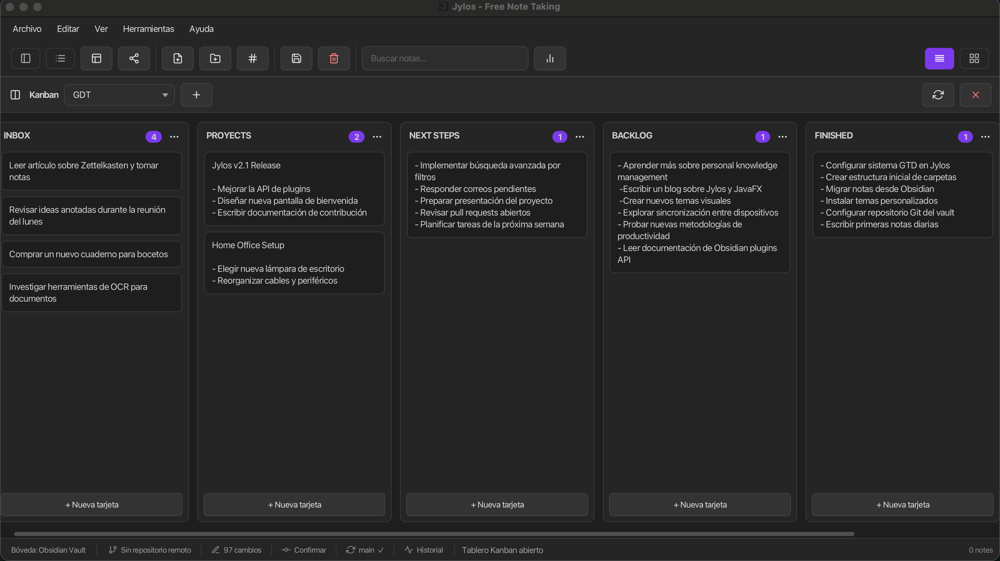

# Jylos

<div align="center">
  <a href="README.es.md">Español</a> |
  <strong>English</strong>
</div>

<div align="center">
  
</div>

<div align="center">

[](LICENSE)
[](changelog.md)
[](https://www.oracle.com/java/)
[](https://openjfx.io/)
[](https://www.sqlite.org/)
[](https://maven.apache.org/)
[]()

</div>

<div align="center">
  <strong>Local-first desktop knowledge management: Markdown notes, wiki-links, backlinks, an interactive knowledge graph, a Kanban board, per-note encryption, plugins, and SQLite or Markdown-vault storage.</strong>
</div>

## Download

Prebuilt packages for all major platforms are available on the [Releases page](../../releases/latest):

- **Windows** — `.exe` installer, `.msi` installer, portable ZIP
- **macOS** — DMG
- **Linux** — DEB/RPM (via `jpackage`)
- **Any platform** — uber-JAR (requires Java 21 + JavaFX 23 on `PATH`)
- **Via [JBang](https://www.jbang.dev/)** — single command, no build needed:
  ```bash
  jbang jylos@RGiskard7/jylos
  ```
  JBang automatically downloads Java 21 and the JavaFX modules if needed.

## Table of Contents

- [Jylos](#jylos)
  - [Download](#download)
  - [Table of Contents](#table-of-contents)
  - [Why Jylos](#why-jylos)
  - [Overview](#overview)
  - [Features](#features)
    - [Core](#core)
    - [Editor \& Preview](#editor--preview)
    - [Task board (Kanban)](#task-board-kanban)
    - [Private notes (encryption)](#private-notes-encryption)
    - [Knowledge graph](#knowledge-graph)
    - [Vault, Git \& attachments (filesystem mode)](#vault-git--attachments-filesystem-mode)
    - [Productivity](#productivity)
    - [UI/UX](#uiux)
    - [Extensibility](#extensibility)
  - [Screenshots](#screenshots)
  - [Technology Stack](#technology-stack)
  - [Prerequisites](#prerequisites)
  - [Quick Start](#quick-start)
    - [1) Clone](#1-clone)
    - [2) Build](#2-build)
    - [3) Run](#3-run)
  - [Scripts and Commands (All OS)](#scripts-and-commands-all-os)
    - [Build / Run Matrix](#build--run-matrix)
    - [Tests and Quality Gates](#tests-and-quality-gates)
    - [Plugins (external JARs)](#plugins-external-jars)
    - [Themes (external)](#themes-external)
    - [Packaging (native installers)](#packaging-native-installers)
    - [Maven development run](#maven-development-run)
  - [Project Structure](#project-structure)
  - [Configuration](#configuration)
    - [Storage](#storage)
    - [App icons](#app-icons)
    - [Themes](#themes)
    - [Plugins](#plugins)
  - [Documentation](#documentation)
  - [Troubleshooting](#troubleshooting)
    - [JavaFX runtime errors](#javafx-runtime-errors)
    - [JAR not found](#jar-not-found)
    - [Maven/Java Missing](#mavenjava-missing)
    - [JavaFX Parent-POM Warnings](#javafx-parent-pom-warnings)
  - [Roadmap](#roadmap)
  - [Contributing](#contributing)
  - [License](#license)

## Why Jylos

Jylos is a local-first knowledge-management application: Markdown notes, wiki-links, backlinks, an interactive knowledge graph, a Kanban board, optional per-note encryption, a plugin system, and your choice of **SQLite** or a plain **Markdown vault** on disk.

The workflows popularized by Obsidian — wiki-links, backlinks, graph navigation — were a direct inspiration, and users already comfortable with that style of note-taking will feel at home from day one. Jylos is, however, an independent application: its own Java/JavaFX codebase, its own storage model (SQLite or raw Markdown vault), its own plugin architecture, and its own design decisions. It is open-source and MIT-licensed. Use whatever tool fits your workflow best.

In concrete terms:

- **Local-first and offline** — your notes are plain `.md` files (vault mode) or a single SQLite database; you own the data, no cloud backend, no account, no telemetry.
- **A focused desktop app** — single-user, written in Java/JavaFX, runs on Windows, macOS and Linux.
- **Free and MIT-licensed** — an open-source project for the community.

## Overview

Jylos is a Java 21 + JavaFX 23 desktop application inspired by Obsidian-like workflows:

- Markdown editor with **live syntax highlighting** (RichTextFX) and a side-by-side preview (GFM, KaTeX math, emoji)
- **Tabs** for multiple open notes, with an inline saved/unsaved indicator
- Folder hierarchy + tags + favorites + recent + trash
- **Obsidian-compatible internal links** (`[[wiki-links]]`, `[label](note.md)`) with click-to-open in preview
- **Knowledge graph** (global vault view or local neighbourhood around the open note)
- **Backlinks** panel listing notes that link to the current note
- **Kanban board** stored inside a note, and a distraction-free **focus / writing mode**
- **Canvas editor**: open and edit Obsidian-compatible `.canvas` files on an infinite, pan/zoom surface — create/move/resize/colour text, link and group nodes, connect and delete edges (with arrowheads), and create new canvases; saves round-trip safely (unknown fields preserved)
- **Private notes**: optional AES-256 body encryption behind a master password, with per-note or global unlock and delete protection
- Command palette (`Ctrl+P`) and quick switcher (`Ctrl+O`)
- External plugins (JARs in `jylos/plugins/`, built from `plugins-source/`) and themes (`themes/` → `jylos/themes/`)
- Storage: **SQLite** (default) or **filesystem Markdown vault** (`.md` + YAML frontmatter; optional **Git** menu for commit/stage/sync)

## Features

### Core

- Create, edit, save, delete, and restore notes
- Hierarchical folders and subfolders
- Tags with assignment/removal workflows (SQLite and vault modes)
- Favorites and recent notes
- Trash with restore for notes and nested folders
- **Full-text search** across note titles and bodies (with navigation from results)
- Sorting and list/grid note views (title, preview lines, dates)

### Editor & Preview

- Markdown editor with **live syntax highlighting** (RichTextFX `CodeArea`: headings, bold/italic, code, `[[wiki-links]]`, lists, quotes, links)
- **Tabs** for multiple open notes; **inline save indicator** (amber = unsaved, green = saved)
- **`[[` autocomplete** for note titles; formatting toolbar (bold, lists, links, …)
- Side-by-side preview with split / editor-only / preview-only modes
- Markdown rendering with GFM tables, autolinks, strikethrough; code-block highlighting in preview (highlight.js)
- **KaTeX** for `$…$`, `$$…$$`, and LaTeX delimiters (offline assets bundled in the JAR)
- Emoji in preview via rasterized glyphs (reliable in the JavaFX WebView)
- **Wiki-link resolution** shared with the graph and backlinks (`WikiLinkResolver`)
- **Transclusion / embeds**: `![[Note]]` (or `![[Note#Heading]]`) embeds another note's rendered content inline in the preview, with a click-to-open header; bounded recursion with cycle detection
- **Rich links**: paste a URL to insert it as a visual card (title, description, thumbnail, site) — metadata fetched in the background; external links open in the system browser
- **Focus / writing mode** (`Ctrl/Cmd+Shift+F`): hides everything but the editor
- Split-pane proportions are remembered between sessions

### Task board (Kanban)

- A board is a normal note whose Markdown body holds columns (`## Heading`) and text cards (`- card`), in the spirit of Obsidian's Kanban plugin
- Open with **View → Kanban Board** or **`Ctrl/Cmd+Shift+K`**; pick or create boards from the toolbar
- Add/rename/delete columns, create/edit/delete cards, and **drag cards between columns**
- A card can link to a note (`[[Title]]`) or be **converted into a note**
- Per-column **WIP limits** (`[wip=N]`, count badge turns red when exceeded) and **colors** (`[color=#rrggbb]`) — both stored in the heading line, set from the column menu
- Cards referencing an image or PDF (``, `[[scan.pdf]]`) show an **embedded thumbnail** (first PDF page via PDFBox)

### Private notes (encryption)

- Mark a note as private to encrypt **only its body** at rest (AES-256-GCM) — from **Tools → Make Note Private/Public** (`Ctrl/Cmd+Shift+L`) or the note's right-click menu
- A single **master password** protects them (PBKDF2-derived key; the password itself is never stored). Opening one locked note prompts to unlock **just that note**; **Tools → Unlock Private Notes** reveals all of them, and **Lock Private Notes** locks again
- A **lock badge** marks private notes in the list and the editor (closed = locked, open = readable this session)
- Private notes are **protected from deletion and export** — turn a note normal first
- Works in **both** storage modes: a dedicated column in SQLite, a `private:` frontmatter flag in the vault; metadata stays readable so a locked note shows as 🔒 without the key

### Knowledge graph

- Full-screen overlay: **View → Graph View**, toolbar button, or **`Ctrl+G`** / command palette
- **Global graph**: all notes and resolved wiki-link edges; optional **tag nodes** and note→tag edges
- **Local graph**: current note plus neighbours within a configurable hop depth
- Native **JavaFX Canvas** force simulation (Barnes–Hut repulsion, link springs, alpha cooling — idle graph uses no CPU)
- Zoom/pan, drag nodes, hover highlights neighbours, **click a note node to open it**
- Settings panel: repulsion, link force/distance, center gravity, orphans/unresolved links, arrows, color-by-folder, label/size/line tuning

### Vault, Git & attachments (filesystem mode)

- Markdown vault with optional folder layout; non-`.md` files (PDF, images) open in built-in viewers
- **Git** integration when the vault is a repository: status, stage/unstage, commit with message, and push/pull sync — all in the unified **Git Sync panel** (see **Git** menu)

### Productivity

- **Backlinks** in the right info panel (incoming wiki-links and internal Markdown links)
- **Daily note** and **new note from template** (`{{title}}`, `{{date}}`, …)
- Per-note and **bulk vault export** to HTML/PDF
- Import/export of individual notes
- **Import an Obsidian vault** (folder hierarchy, frontmatter and tags preserved; `.obsidian/` skipped) or an **Evernote `.enex`** export (ENML converted to Markdown, tags kept, attachments noted as placeholders) — File menu
- **Note version history** (Tools → Note History, `Ctrl/Cmd+Shift+H`): local snapshots taken before each save (coalesced, capped at 50 per note), with a line **diff** viewer and one-click **restore**; private notes' snapshots stay encrypted

### UI/UX

- Light, dark, and **system** themes (OS theme polling when “System” is selected) + external CSS themes
- **CSS snippets**: drop `.css` files into `snippets/` and toggle them in Preferences to tweak the UI over the active theme (Obsidian-style)
- Sample external theme: Retro Phosphor (`themes/retro-phosphor/`)
- Configurable sidebar/editor button presentation (text/icons/auto)
- Centered sidebar navigation (folders, tags, recent, favorites, trash)
- UI strings in **English** and **Spanish** (`i18n/messages*.properties`)
- Toolbar uses **Feather** and **Bootstrap** icons via Ikonli (`fth-*` / `bi-*` in FXML — not separate image files)

### Extensibility

- External plugin JARs loaded from `jylos/plugins/` (see `scripts/build-plugins.sh`; bytecode **Java 21**)
- Plugin manager UI with stable command IDs and safe load/disable lifecycle
- Plugin API: command palette, menus, side panels, preview enhancers, **toolbar buttons** and **editor hooks** (`onBeforeTextInsert` / `onBeforeSave` / `onAfterSave`) — see [doc/PLUGINS.md](doc/PLUGINS.md)
- Built-in **Mermaid** diagram support in preview (plugin source under `plugins-source/`)
- Theme catalog with external theme discovery and safe fallback

## Screenshots

<div align="center">
  
  
  
  
  
  
  
  
  
  
  
  
  
  
  
  
</div>

## Technology Stack

- Java 21
- JavaFX 23
- Maven 3.9+
- SQLite JDBC
- CommonMark (Markdown preview)
- RichTextFX (editor syntax highlighting)
- Ikonli (Feather icons + Bootstrap Icons)
- PDFBox + OpenHTMLToPDF (PDF export / viewer)
- JUnit 5 + H2 (tests)

## Prerequisites

1. Java JDK 21
2. Maven 3.9+

Check installation:

```bash
java -version
mvn -version
```

## Quick Start

### 1) Clone

```bash
git clone https://github.com/RGiskard7/jylos.git
cd jylos
```

### 2) Build

From the repository root (produces `jylos/target/jylos-2.2.0-uber.jar`):

```bash
./scripts/build_all.sh
```

```powershell
.\scripts\build_all.ps1
```

Equivalent Maven command:

```bash
mvn -f jylos/pom.xml clean package -DskipTests
```

### 3) Run

**Option A — JBang (no build required):**

```bash
jbang jylos@RGiskard7/jylos
```

**Option B — Launcher script** (sets JavaFX `--module-path`; requires the uber-JAR from step 2):

```bash
./scripts/launch-jylos.sh
```

```powershell
.\scripts\launch-jylos.bat
# or
.\scripts\launch-jylos.ps1
```

`run_all.*` is an alternative dev runner. Plain `java -jar` without module-path often fails on JavaFX.

## Scripts and Commands (All OS)

All commands assume the **repository root** (the folder that contains `jylos/` and `scripts/`).

### Build / Run Matrix

| Purpose | Linux/macOS | Windows PowerShell | Windows CMD |
|---|---|---|---|
| Build app | `./scripts/build_all.sh` | `.\scripts\build_all.ps1` | N/A |
| Run app (dev runner) | `./scripts/run_all.sh` | `.\scripts\run_all.ps1` | N/A |
| Run app (launcher, recommended) | `./scripts/launch-jylos.sh` | `.\scripts\launch-jylos.ps1` | `.\scripts\launch-jylos.bat` |

### Tests and Quality Gates

```bash
mvn -f jylos/pom.xml test
mvn -f jylos/pom.xml clean test
```

```bash
./scripts/smoke-phase-gate.sh
./scripts/hardening-storage-matrix.sh
```

```powershell
.\scripts\smoke-phase-gate.ps1
.\scripts\hardening-storage-matrix.ps1
```

### Plugins (external JARs)

```bash
./scripts/build-plugins.sh
./scripts/build-plugins.sh --clean
```

```powershell
.\scripts\build-plugins.ps1
.\scripts\build-plugins.ps1 -Clean
```

### Themes (external)

```bash
./scripts/build-themes.sh
./scripts/build-themes.sh --clean
./scripts/build-themes.sh --appdata
```

```powershell
.\scripts\build-themes.ps1
.\scripts\build-themes.ps1 -Clean
.\scripts\build-themes.ps1 -AppData
```

### Packaging (native installers)

**Requirements:** full **JDK 21+** (not JRE) with `jpackage` on `PATH`. Run from the **repository root**.

Each `package-*` script builds the uber-JAR, optionally runs `build-plugins.sh`, then invokes `jpackage`. Main class: `com.example.jylos.Launcher`.

| Platform | Command | Typical output |
|---|---|---|
| macOS (DMG) | `./scripts/package-macos.sh` | `jylos/target/installers/Jylos-2.2.0.dmg` |
| Linux (deb/rpm) | `./scripts/package-linux.sh` | `jylos/target/installers/` |
| Windows portable (app-image) | `.\scripts\package-windows.ps1` | `jylos\target\installers\Jylos\` |
| Windows .exe installer (WiX) | `.\scripts\package-windows-exe.ps1` | `jylos\target\installers\Jylos-<version>.exe` |
| Windows .msi installer (WiX) | `.\scripts\package-windows-msi.ps1` | `jylos\target\installers\Jylos-<version>.msi` |

```bash
./scripts/package-macos.sh
./scripts/package-linux.sh
```

```powershell
.\scripts\package-windows.ps1
```

Icons: window + About dialog use `jylos/src/main/resources/icons/app-icon.png`; installers use `icon.{icns,ico,png}` (see `app.properties` and [jylos/src/main/resources/icons/README.md](jylos/src/main/resources/icons/README.md)). Details: [doc/PACKAGING.md](doc/PACKAGING.md).

### Maven development run

Prefer launchers for JavaFX. If using Maven directly:

```bash
mvn -f jylos/pom.xml javafx:run
```

Or:

```bash
mvn -f jylos/pom.xml clean compile exec:java -Dexec.mainClass="com.example.jylos.Launcher"
```

## Project Structure

Repository root (contains the Maven module `jylos/` and `scripts/`):

```text
<repo-root>/
├── jylos/                              # Maven module (app)
│   ├── pom.xml
│   ├── src/main/java/com/example/jylos/
│   │   ├── config/                     # LoggerConfig
│   │   ├── data/                       # models; DAOs (sqlite/, filesystem/)
│   │   ├── event/                      # EventBus + domain events
│   │   ├── exceptions/
│   │   ├── git/                        # GitService (vault repositories)
│   │   ├── graph/                      # GraphBuilder, GraphData, nodes/edges
│   │   ├── plugin/                     # loader, manager, registries; mermaid/
│   │   ├── service/                    # Note, Folder, Tag, Backlink, backup, …
│   │   ├── ui/
│   │   │   ├── controller/             # Main, Editor, Sidebar, Graph, Toolbar, …
│   │   │   ├── components/             # CommandPalette, QuickSwitcher, FileViewer
│   │   │   └── graph/                  # GraphCanvas (force-directed renderer)
│   │   └── util/                       # WikiLinkResolver, MarkdownPreview, NoteExporter
│   ├── src/main/resources/
│   │   ├── app.properties              # app name, icon paths, window title
│   │   ├── icons/                      # app-icon.png + icon.{ico,icns,png}
│   │   └── com/example/jylos/
│   │       ├── i18n/                   # messages.properties, messages_en/es
│   │       ├── ui/css/                 # modern-theme.css, dark-theme.css
│   │       ├── ui/view/                # FXML (MainView, EditorView, GraphView, …)
│   │       └── ui/preview/             # KaTeX, highlight.js (bundled offline)
│   ├── src/test/java/com/example/jylos/
│   ├── plugins/                        # runtime plugin JARs (often gitignored)
│   ├── themes/                         # installed external themes
│   ├── data/                           # runtime DB or vault (gitignored)
│   ├── logs/
│   └── backups/
├── plugins-source/                     # plugin sources → build-plugins → jylos/plugins/
├── themes/                             # theme sources → build-themes → jylos/themes/
├── resources/images/                   # README banner and screenshots
├── scripts/                            # build, launch, package, smoke tests
├── doc/                                # technical docs (see doc/README.md)
├── AGENTS.md
├── changelog.md
├── README.md
└── README.es.md
```

Not part of the app: `replica-grafo/` (optional Typst/graph experiment; see [doc/README.md](doc/README.md)).

## Configuration

### Storage

- **SQLite** (default): `jylos/data/database.db`
- **Filesystem vault**: folder of `.md` notes with YAML frontmatter; switch in **Tools → Switch storage** (restart required)
- Other runtime dirs (auto-created under `jylos/`): `logs/`, `backups/`, `plugins/`, `themes/`

### App icons

| Asset | Path | Used for |
|-------|------|----------|
| In-app window + About | `jylos/src/main/resources/icons/app-icon.png` | `app.icon.window` in `app.properties` |
| Windows installer | `icons/icon.ico` | `app.icon.windows` |
| macOS installer | `icons/icon.icns` | `app.icon.macos` |
| Linux installer | `icons/icon.png` | `app.icon.linux` |

Toolbar/sidebar icons are **Feather** and **Bootstrap Icons** glyphs via Ikonli (`fth-*` / `bi-*` in FXML), not files in `icons/`.

### Themes

Source packs live in `themes/<id>/` (`theme.properties` + `theme.css`). Development: `./scripts/build-themes.sh` (copies to `jylos/themes/`). **Packaged app:** copy the theme folder to `~/Library/Application Support/Jylos/themes/<id>/` (macOS), `%APPDATA%\Jylos\themes\<id>\` (Windows), or `~/.config/Jylos/themes/<id>/` (Linux). See [themes/README.md](themes/README.md).

### CSS snippets

Drop plain `.css` files into the `snippets/` folder to tweak the interface on top of the active theme (Obsidian-style), without authoring a full theme. Enable them in **Preferences → CSS snippets**; each enabled snippet is layered **after** the theme, so its rules win. Use **Open folder** in that dialog to reach the directory (`<appData>/snippets`). Snippet names must be simple `.css` filenames. Ready-made, theme-adaptive examples (Atom One, Nord, Solarized — each with a dark and light variant) live in [snippets-examples/](snippets-examples/). Snippets can branch on the `theme-dark` / `theme-light` class Jylos sets on the scene root (Obsidian-style).

### Plugins

- Build: `./scripts/build-plugins.sh` → `jylos/plugins/*.jar` (compile target **Java 21**)
- Enable/disable in **Tools → Manage plugins**

## Documentation

- [doc/README.md](doc/README.md) — index
- [doc/BUILD.md](doc/BUILD.md)
- [doc/LAUNCH_APP.md](doc/LAUNCH_APP.md)
- [doc/ARCHITECTURE.md](doc/ARCHITECTURE.md)
- [doc/ARCHITECTURE_GUIDELINES.md](doc/ARCHITECTURE_GUIDELINES.md)
- [doc/PLUGINS.md](doc/PLUGINS.md)
- [doc/PACKAGING.md](doc/PACKAGING.md)
- [doc/EVENT_BUS_CONTRACT.md](doc/EVENT_BUS_CONTRACT.md)
- [AGENTS.md](AGENTS.md)
- [changelog.md](changelog.md)

## Troubleshooting

### JavaFX runtime errors

Use `launch-jylos.*` (module-path included). Run `build_all` first if the JAR is missing.

### JAR not found

```bash
./scripts/build_all.sh
```

### Maven/Java Missing

Ensure both are available in `PATH`:

```bash
java -version
mvn -version
```

### JavaFX Parent-POM Warnings

Warnings such as `Failed to build parent project for org.openjfx:javafx-*` are known and non-blocking.

## Roadmap

The items below reflect areas of genuine interest for future development. This is not a delivery commitment — it is an open direction, and contributions are welcome.

- **Local HTTP API**: a read/write REST interface bound to `localhost` with Bearer token auth, enabling scripting integrations (Alfred, Raycast, shell pipelines) while keeping private notes protected
- **Automated CI/CD**: GitHub Actions workflow to run tests on every PR and publish platform builds automatically on version tags
- **Plugin API depth**: richer lifecycle hooks and better documentation to make third-party plugin development more ergonomic
- **Platform integration**: system tray support and more polished OS-level packaging per platform
- **Community feedback**: features and fixes driven by real usage reports and pull requests

## Contributing

- Keep changes focused and incremental.
- Run tests before opening PR.
- Preserve SQLite/FileSystem and plugin compatibility.
- Update documentation when behavior changes.

## License

[MIT License](LICENSE) — Copyright © 2025–2026 **Eduardo Díaz Sánchez**.

You may use, modify, and distribute this software under the MIT terms; keep the copyright and license notice in copies or substantial portions. Contact: ed.dzsn@protonmail.com
